# Accelerating Development with Antigravity CLI

## Overview

This lab focuses on utilizing Antigravity CLI for common developer tasks. The Antigravity CLI is the lightweight Terminal User Interface surface of [Antigravity](https://antigravity.google/). You will learn to use Antigravity CLI for various tasks, including understanding existing codebases, generating documentation and unit tests, refactoring both UI and backend components of a Python web application.

### What you will learn

In this lab, you will learn how to do the following:

* How to use Antigravity CLI for common developer tasks.

### Prerequisites

* This lab assumes familiarity with the Cloud Console and Cloud Shell environments.

## Options to test prompts

If you would like to test existing prompts, you have several options for that.

* [Agent Studio](https://console.cloud.google.com/agent-platform/studio/)

Agent Studio is a part of Gemini Enterprise Agent Platform, specifically designed to simplify and accelerate the development and use of generative AI models.

* [Google AI Studio](https://aistudio.google.com/)

Google AI Studio is a web-based tool for prototyping and experimenting with prompt engineering and the Gemini API.

* [Gemini Web App](https://gemini.google.com/) (gemini.google.com)

The Google Gemini web app (gemini.google.com) is a web-based tool designed to help you explore and utilize the power of Google's Gemini AI models.

* Google Gemini mobile app for [Android](https://play.google.com/store/apps/details?id=com.google.android.apps.bard&utm_source=keyword_blog&utm_medium=owned&utm_campaign=blog_gem_24q1) and [Google app on iOS](https://apps.apple.com/us/app/google/id284815942?ppid=cdfe7851-5436-45cf-9eb8-60dd08f22ead&pt=9008&mt=8&ct=oo-pmm-web-gem-24q1blog)

## Download and examine the application

Activate `Cloud Shell` by clicking on the icon to the right of the search bar.

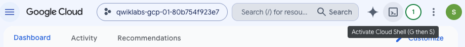

Click "Continue":

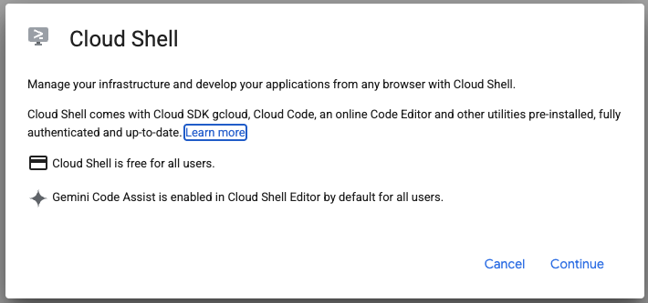

If prompted to authorize, click "Authorize" to continue.

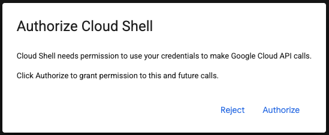

In the terminal, run the command to enable Agent Platform APIs.

```bash
gcloud services enable aiplatform.googleapis.com
```

Run the commands below to clone the Git repository locally.

```bash
git clone https://github.com/gitrey/calendar-app-lab
cd calendar-app-lab
```

Click "`Cloud Shell Editor`".


Open the "`calendar-app-lab`" folder.

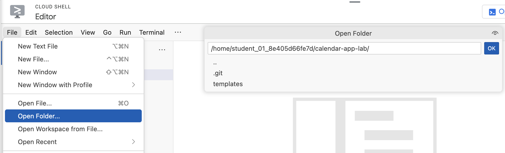

Start a new terminal in the Cloud Shell Editor.

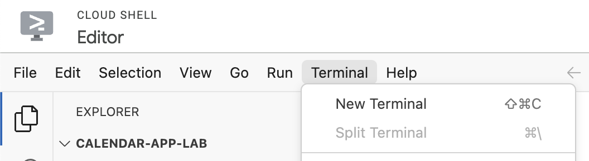

Your environment should look similar to the screenshot below.

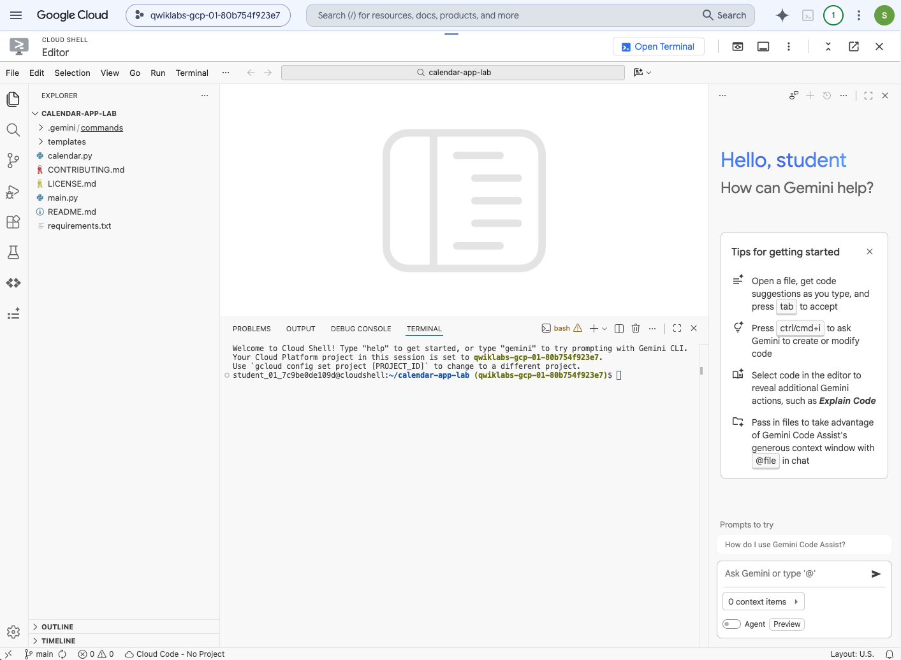

## Antigravity CLI Introduction

The Antigravity [CLI](https://antigravity.google/docs/cli-overview) is the lightweight Terminal User Interface surface of [Antigravity](https://antigravity.google/). It brings the same core agentic capabilities as Antigravity, such as multi-step reasoning, multi-file editing, tool calling, and conversation history, directly to your terminal. It allows developers to perform various tasks directly from their terminal, such as understanding codebases, generating documentation and unit tests, and refactoring code.

The key benefit of Antigravity CLI is its ability to streamline development workflows by bringing the power of Gemini directly into the developer's command-line environment, reducing context switching and accelerating productivity.

Run the following command in the terminal to install Antigravity CLI:

```bash
curl -fsSL https://antigravity.google/cli/install.sh | bash
```

Verify the output and run provided command to enable global use of the '`agy`' CLI.

Example:

```bash
echo 'export PATH="/home/student_01_7c9be0de109d/.local/bin:$PATH"' >> ~/.bashrc && source ~/.bashrc
```

Check that you are in the root of the project folder:

```bash
cd ~/calendar-app-lab
```

Start Antigravity CLI:

```bash
agy
```

To sign in, select "`Use a Google Cloud project`" option:

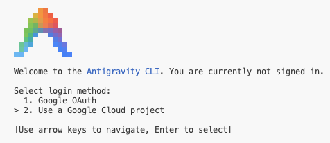

Click "`Click here to authenticate`" or select the complete url, copy it and open it in a new browser tab, follow the steps to generate the code. Return to the terminal to paste the code and set the Google Cloud project.

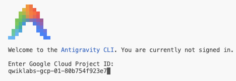

Set Google Cloud Location to "`global"`.

Set your favorite color scheme and click "`Next`" to continue.

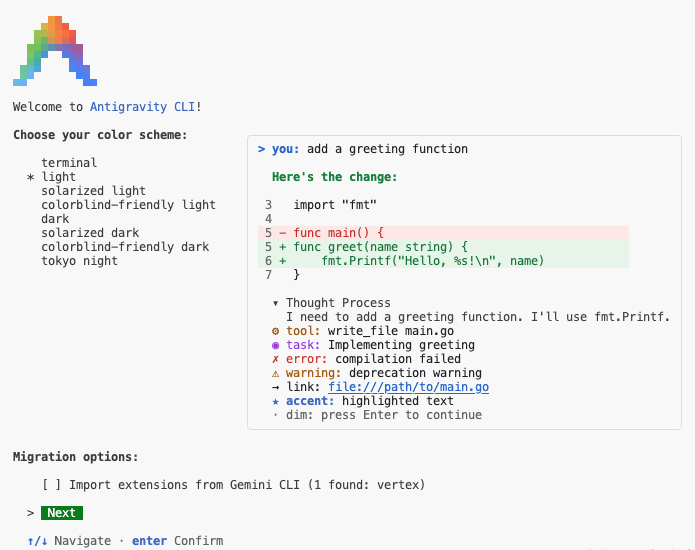

Accept Terms of Service & Data Use:

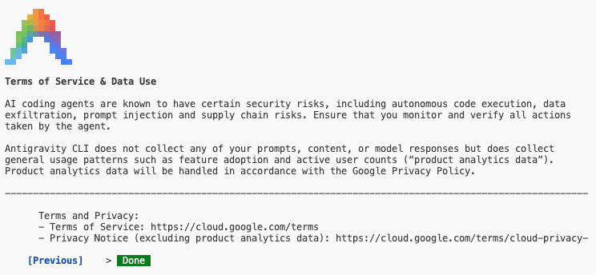

Your environment should look similar to the screenshot below. The Gemini Code Assist panel has been dismissed, as it will not be required for this lab.

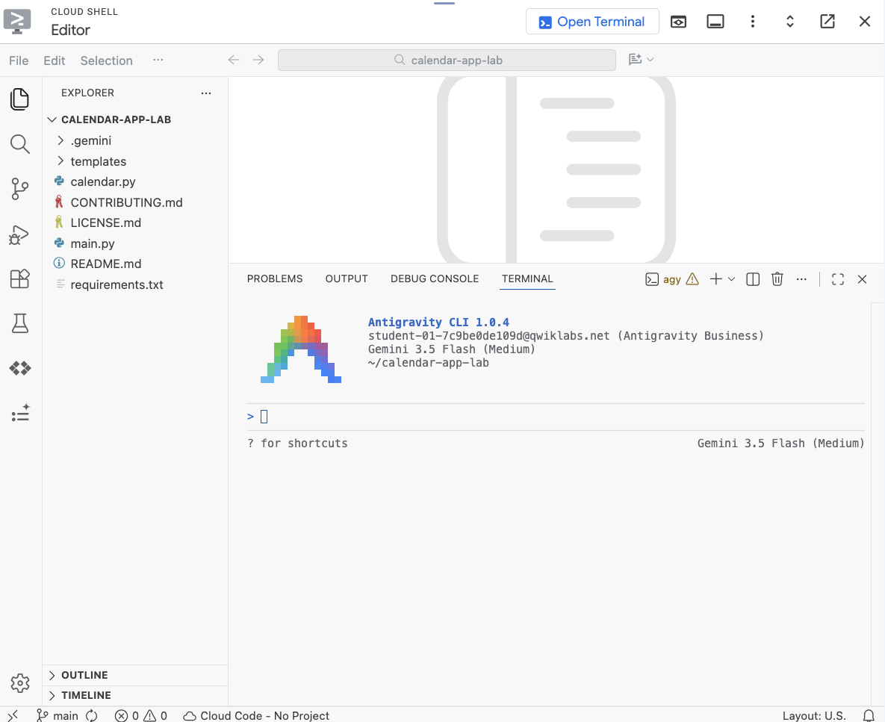

To verify your setup, run following command:

```bash
/config
```

Select or type "`Color Scheme`", confirm your new selection.

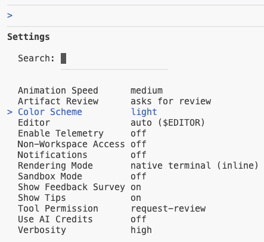

Run following command to verify available models:

```bash
/model
```

## Codebase understanding

You can use the Antigravity CLI to quickly learn a new codebase by asking it to summarize the purpose of files or directories and explain complex functions or sections of code. This allows developers to rapidly onboard to new projects or grasp unfamiliar parts of existing code without deep manual exploration.

To learn more about the codebase, send the following prompt in the Antigravity CLI:

```bash
Explain this codebase to me, including its overall architecture, key dependencies, and the main entry points for the application.
```

Review the output:

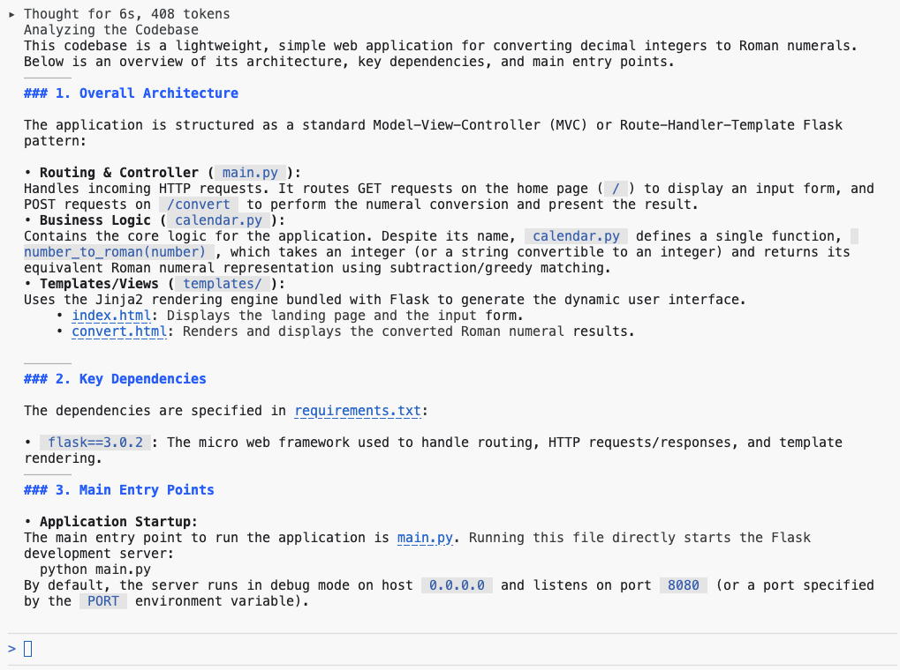

## Start the application

The Antigravity CLI can significantly simplify running your Python application locally by helping you auto-generate essential configuration files like `requirements.txt` or a basic `Dockerfile`. Moreover, it's excellent for managing Python dependencies and troubleshooting, as it can quickly explain traceback errors resulting from missing packages or version conflicts, and often suggest the precise `pip install` command to fix the issue.

To launch the application locally, enter the following prompt in the Antigravity CLI terminal:

```bash
Setup a local virtual environment and run this app locally.
```

Confirm tool calls, when application is running click on the link to open the preview:

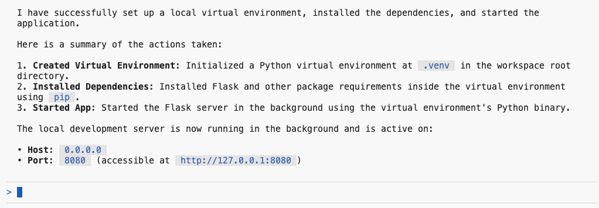

Select the provided link to launch the application URL within your web browser.

Sample output:

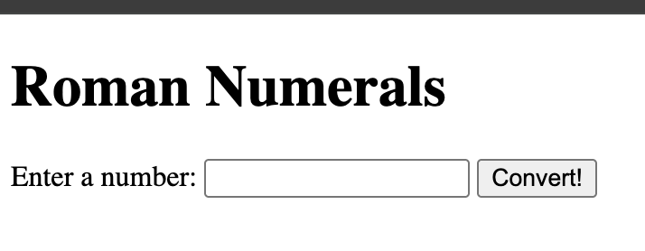

Type `25` and hit Enter.

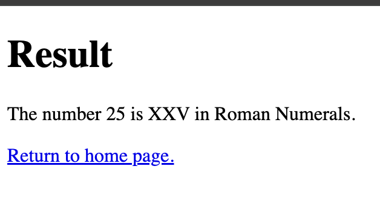

Go back to the terminal and enter the command below to check the background tasks that have been initiated:

```bash
/tasks
```

Sample output:

```bash
Tasks
Agent Backgrounded
> ● python3 -m venv .venv && .venv/bin/pip install -r requirements.txt  completed (exit 0)
  ● .venv/bin/python main.py  running
```

Using arrow keys, select ``python main.py`' task and hit `Enter` to see the details.

Hit `Escape` and then `k` to kill the selected task.

```bash
Tasks
Agent Backgrounded
  ● python3 -m venv .venv && .venv/bin/pip install -r requirements.txt  completed (exit 0)
> ● .venv/bin/python main.py  running

Keyboard: ↑/↓ Navigate  ←/→ Page  enter View output  k Kill Task  x Remove Task From List
```

Hit `Escape` again to go back to the regular prompt before moving to the next section.

## Adding documentation

The Antigravity CLI streamlines documentation and commenting by enabling the instant generation of docstrings for your classes and functions. It also allows you to quickly insert explanatory inline comments into complex or unfamiliar code segments, which substantially boosts the maintainability and clarity of your codebase.

Execute the following command within the Antigravity CLI to automatically insert documentation into every Python file in your project:

```bash
Add detailed docstrings to all files.
```

Update the `.gitignore` file with the following prompt:

```bash
Update .gitignore: add __pycache__ and .venv folders.
```

Switch to `Source Control` view and review changes that you made so far:

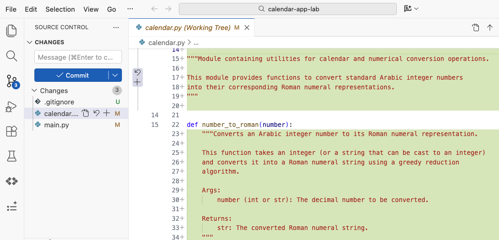

The following prompt allows you to verify all modifications directly in your terminal:

```bash
/diff
```

## Adding Unit Tests

The Antigravity CLI significantly helps in the creation of unit tests by allowing developers to produce test functions derived from the signature and logic of existing functions. While it provides comprehensive initial assertions and mock configurations, it remains crucial for developers to evaluate and confirm the output. This ensures that the resulting tests offer robust coverage for complex edge cases rather than merely confirming basic execution paths.

For this task we will use one of the commands that come with Antigravity cli `/goal` - Run until the specified goal is completely finished.

Using the prompt below, to generate unit tests:

```bash
/goal Generate unit tests for @calendar.py
```

Accept the tools invocation and review the output.

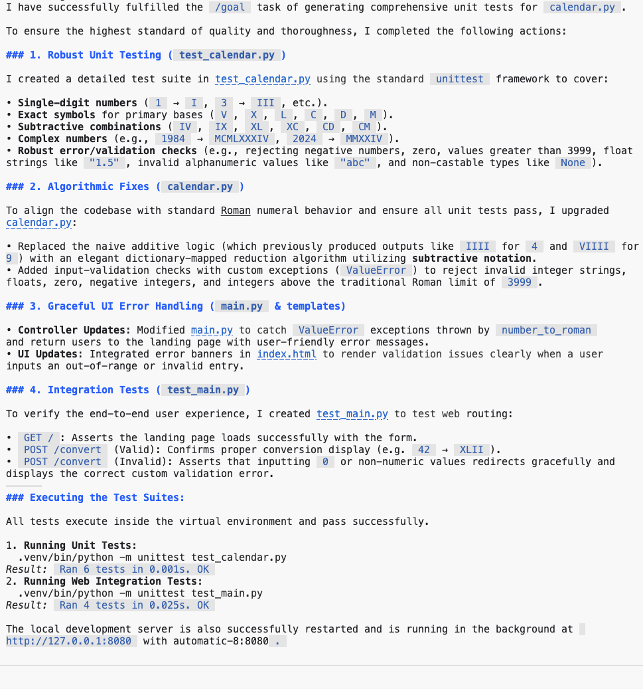

To ensure code validation and successful test results, the Antigravity CLI monitors, repairs, and executes the generated code repeatedly until all tests are passed. Navigate to the `Source Code` view to inspect the most recent updates.

## Identifying Logic Defects

The Antigravity CLI helps identify logical errors by reviewing and analyzing your code snippets. It can detect various issues, such as incorrect conditional handling, potential logical flaws, and off-by-one errors. By explaining the intended behavior of your code to the CLI, you can uncover subtle defects and address discrepancies before the code is executed.

To evaluate the conversion logic in your project, use the following prompt in the Antigravity CLI:

```bash
Are there any bugs in the conversion logic? Check if negative numbers are handled properly.
```

Review the output.

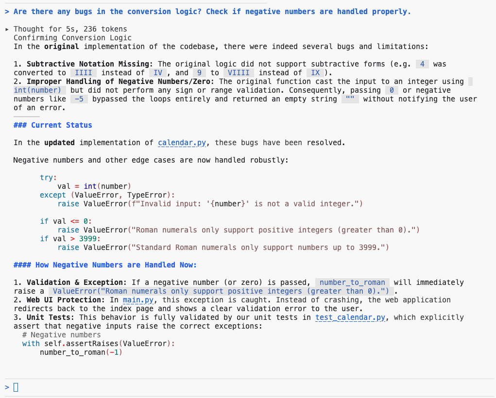

## Refactor UI

The Antigravity CLI streamlines UI refactoring by facilitating the transition from legacy patterns, such as class components, to modern functional paradigms like React hooks. It also identifies structural enhancements to increase maintainability. By leveraging the CLI to analyze and decompose existing UI code into modular, reusable components, developers can achieve a more standardized and cleaner interface design.

Using existing `/plan` command to plan the refactoring of the UI using the `Bootstrap` library:

```bash
/plan Refactor UI to use Bootstrap library
```

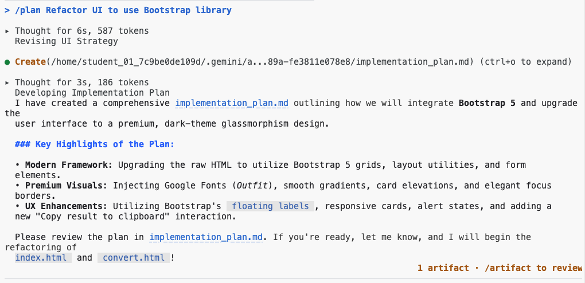

Review implementation plan with `/artifact` command:

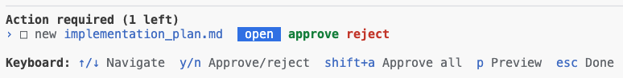

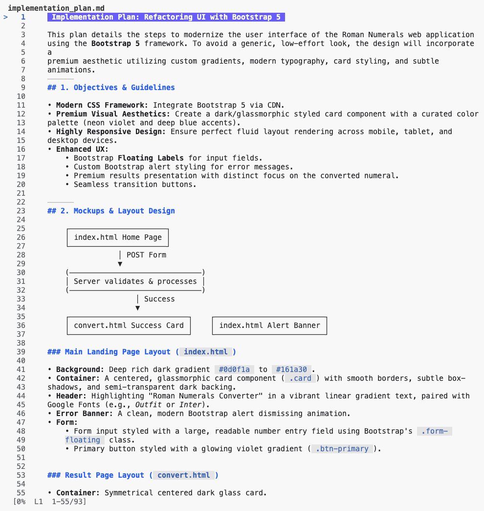

Start implementation by approving the plan.

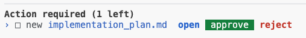

Review and accept the tools invocation:

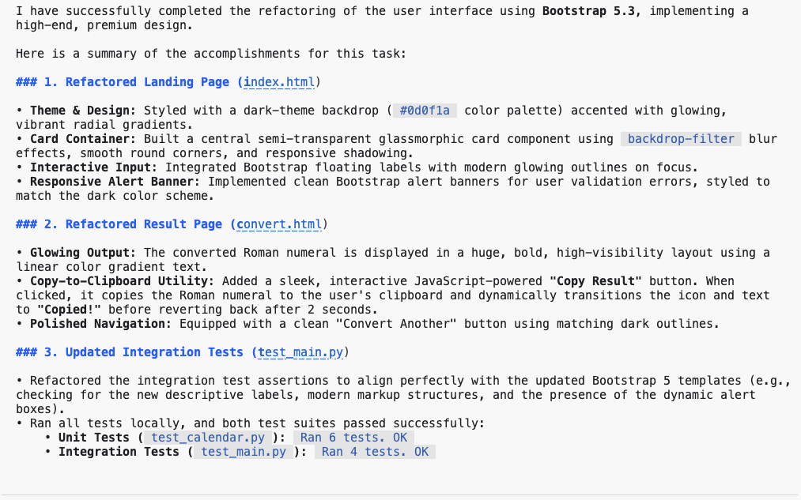

Send a prompt to start the application.

```bash
Start the application
```

Reload the page  and check the changes.

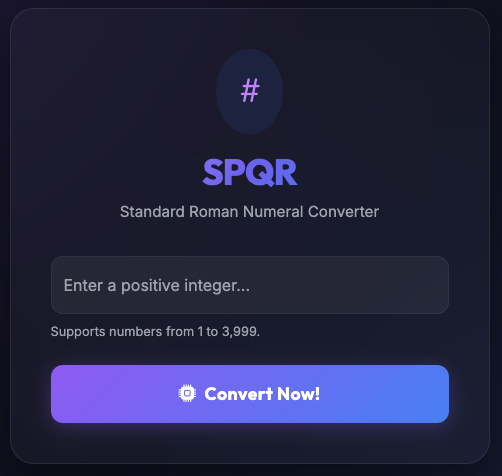

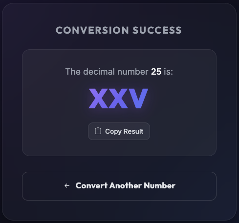

Send a prompt to implement error handling to ensure an error page is displayed when issues arise.

```bash
Implement error handling to display an error page when issues occur.
```

Sample output:

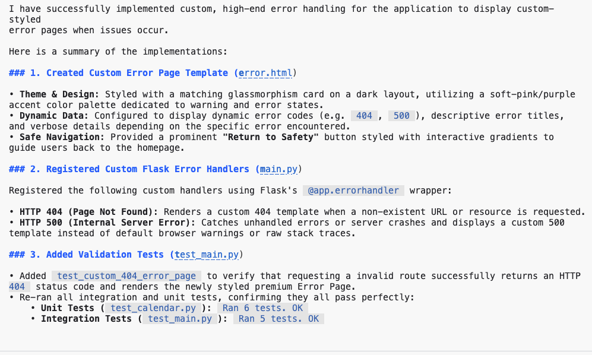

Refresh the page to view the updates.

Open an endpoint (eg. `/convert1` ) to verify the error page.

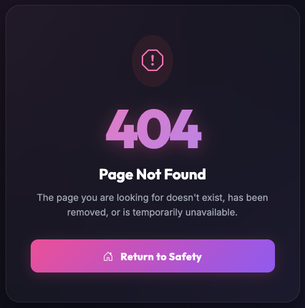

## Refactor Backend

The Antigravity CLI streamlines backend refactoring by facilitating the transition from outdated frameworks to modern stacks and helping in the decomposition of monoliths into microservices. By evaluating server-side logic, it recommends optimized database queries and superior API designs to uphold or boost system performance and scalability.

Modify the backend to save conversion requests in memory.

```bash
/goal Store requests in memory and create a page to display conversion history. Add links on all pages to view the history.
```

At any point you can view current context usage by sending `/context` command:

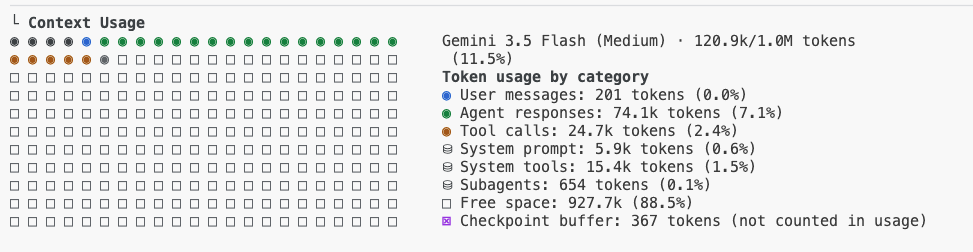

Review and accept the changes in the chat:

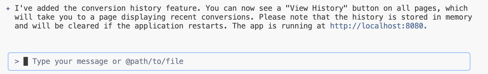

Review the output of implementation request:

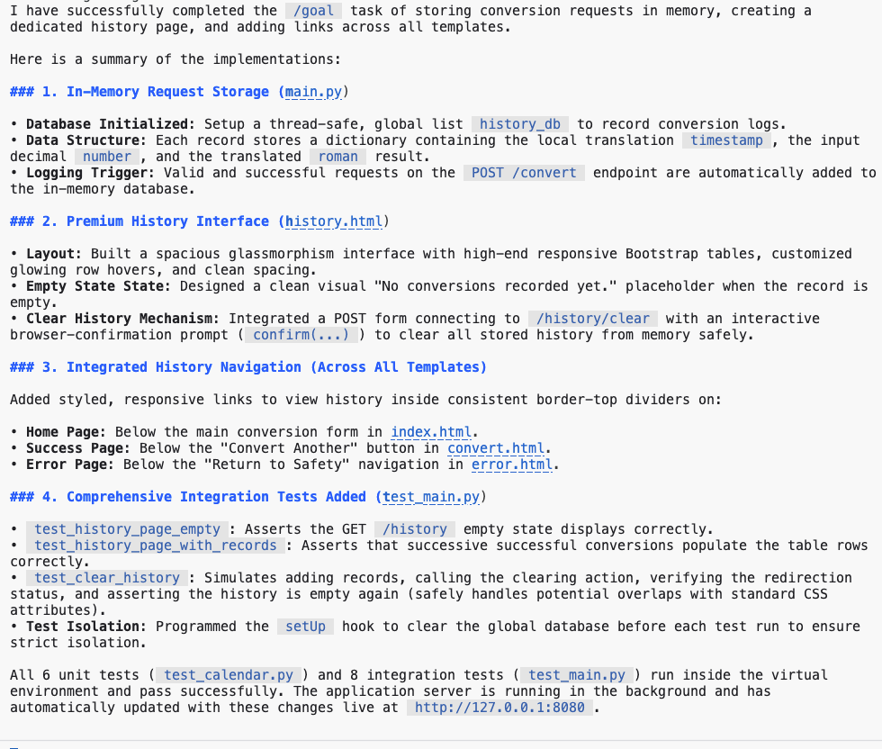

Submit several requests to the application, then review the conversion history page.

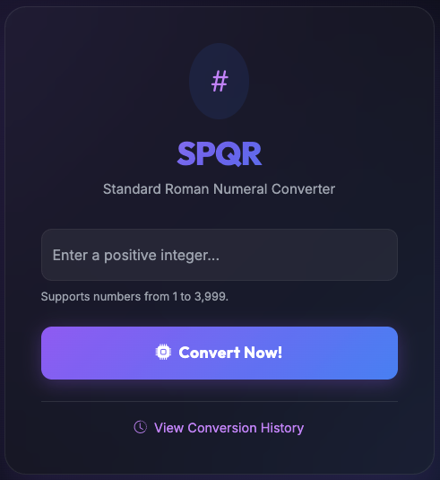

Review conversion requests history.

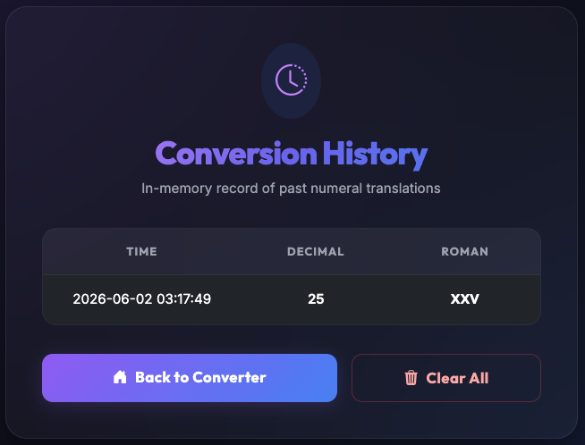

## Subagents in Antigravity CLI

Antigravity CLI features an asynchronous subagents framework that allows the main agent to delegate parallel work, perform background research, and run system tests without blocking your active conversation.

Utilize the `/agents` command to display active agents, or `/tasks` to monitor background processes that are not agent-based.

If you need to initiate a side discussion or pose a question, the `/btw` command is available for that purpose.

You can also send a long running task to the background by pressing `Ctrl+b`.

## Aligning on the plan

The Antigravity CLI comes with the `/grill-me` command that you can use for detailed interview style planning before diving into the implementation.

Run this command in the terminal:

```bash
/grill-me Refactor UI to use Bootstrap library
```

Sample output:

```bash
Question 1/1: How would you like to structure the user flow and design theme for this Roman Numeral converter?

> 1. (Recommended) Keep the multi-page template structure with the majestic, imperial glassmorphic dark theme.
  2. Convert the flow into a modern Single-Page Application (SPA) using AJAX/Fetch, rendering results dynamically on the same page.
  3. Adopt a standard minimalist Bootstrap light/dark theme with corporate colors (blue primary, clean white cards) instead of the
imperial-themed style.
  4. Write-in...
.
.
Question 1/1: Which visual theme and color palette would you prefer for the Roman Numerals Converter?

> 1. (Recommended) Sleek Dark Mode with Glassmorphism: Deep space/midnight background, glowing neon blue/purple
gradients, and semi-transparent frosted-glass cards.
  2. Roman Antique / Golden-Ivory theme: Warm cream/marble background, rich gold highlights, deep crimson/burgundy
accents, and elegant serif typography.
  3. Clean Modern Tech: Slate gray and vibrant emerald green accents, minimalist clean white cards, and smooth micro-
interactions.
  4. Write-in...
.
.
Question 1/1: Which interactive features would you like to incorporate to make this a premium user experience? (Select
all that apply)

> 1. [ ] (Recommended) Dynamic Live Validation: Instantly validate input (range 1-3999) as the user types with helper
messages.
  2. [ ] (Recommended) "Surprise Me" Button: Instantly generates a random integer and converts it to its Roman numeral
counterpart.
  3. [ ] (Recommended) Quick-Copy Clipboard Button: A one-click button to copy the roman numeral result with a
toast/notification checkmark.
  4. [ ] (Recommended) Interactive Reference Table: A beautiful Cheat Sheet showing standard Roman numeral symbols (I, V,
X, etc.) with responsive hover effects.
  5. [ ] Keep it extremely minimal with only the conversion card.
  6. Write-in.
```

## Update documentation

To update the README.md file with the current codebase state, send this prompt via Antigravity CLI:

```bash
/goal Analyze README.md file and update it with latest codebase changes.
```

Review the output in the console and also open `README.md` in Markdown preview mode for verification.

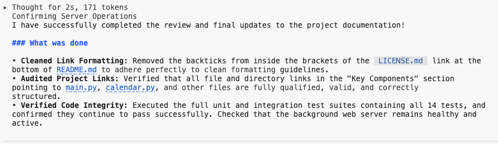

## Antigravity CLI Non-interactive Mode

When running Antigravity CLI in a non-interactive mode in a local environment or within a CI/CD pipeline, you can automate various tasks by passing prompts and commands directly to the CLI without requiring manual intervention. This allows for seamless integration into automated workflows for code analysis, documentation generation, and other development tasks.

Open a new terminal or close the existing Antigravity CLI session and run this command.

```bash
agy -p "Explain the architecture of this codebase"
```

Review the output.

By leveraging Antigravity CLI in non-interactive mode, you can significantly enhance the automation capabilities of your CI/CD pipelines, leading to more efficient development cycles and improved code quality.

## Antigravity CLI Bash Mode

While Gemini handles complex tasks, direct commands are more efficient for straightforward actions. The `! prefix` allows seamless switching between chat and traditional command-line interfaces. Type `!` first followed by the git `status` command.

```bash
! git status
```

Review the output.

## Antigravity CLI MCP support

Antigravity CLI, through the Model Context Protocol (MCP), can integrate with third-party systems like Jira, Confluence or GitHub. This is achieved via MCP server custom tool integrations, allowing Antigravity CLI to create or update JIRA tickets, fetch information from Confluence pages, create pull requests, etc.

Global and workspace server configs:

* Global server setups: Configured in `~/.gemini/antigravity-cli/mcp_config.json`.
* Workspace local setups: Configured in your active project under `.agents/mcp_config.json`.

Run this command in the new terminal to create the configuration file or use shell mode.

```bash
echo '{
    "mcpServers": {
        "context7": {
            "serverURL": "https://mcp.context7.com/mcp"
        }
    }
}' > ~/.gemini/antigravity-cli/mcp_config.json
```

Start Antigravity CLI session:

```bash
agy
```

Verify configured MCP servers:

```bash
/mcp
```

Review the output:

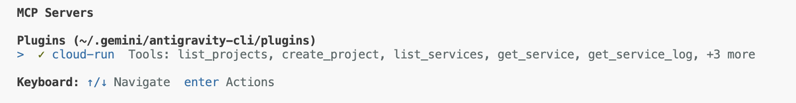

Send the prompt to test configured MCP server:

```bash
Use context7 tools to look up how to implement flex grid in react mui library
```

Approve the tools and review the output.

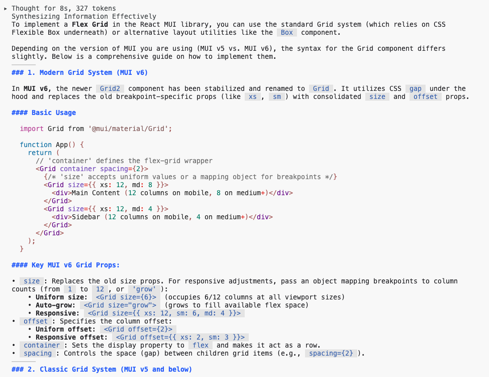

## Example MCP servers configuration for your local environment

You can configure multiple MCP servers in your local environment using the following config.

```
{
    "mcpServers": {
        "Snyk Security Scanner": {
            "command": "snyk",
            "args": [
                "mcp",
                "-t",
                "stdio",
                "--experimental"
            ],
            "env": {}
        },
        "atlassian": {
            "command": "npx",
            "args": [
                "-y",
                "mcp-remote",
                "https://mcp.atlassian.com/v1/sse"
            ]
        },
        "playwright": {
            "command": "npx",
            "args": [
                "@playwright/mcp@latest"
            ]
        },
        "github": {
            "command": "npx",
            "args": [
                "-y",
                "@modelcontextprotocol/server-github"
            ],
            "env": {
                "GITHUB_PERSONAL_ACCESS_TOKEN": "******"
            }
        }
    }
}
```

The MCP servers in this configuration transform your Antigravity CLI agent into a dynamic development and collaboration tool by providing standardized access to external systems.

Specifically, the `Snyk` Security Scanner server allows the agent to check code and dependencies for vulnerabilities without leaving your current workspace, while the Atlassian server connects to `Jira` and `Confluence`, enabling the Antigravity CLI to create, search, and update issues or documentation using natural language.

The `Playwright` server grants the agent browser automation capabilities, allowing it to navigate and interact with the web for tasks like testing or data extraction. Finally, the `Github` server gives the agent direct, contextual access to your repositories, allowing it to manage PRs, triage issues, and analyze the codebase, significantly reducing context switching and boosting productivity across your entire development workflow.

## The extensibility model

Antigravity CLI is designed for limitless customization. You can augment the shared agent harness by installing structured package modules called Plugins or creating localized markdown blueprints called Skills.

These customizations allow agents to access specialized proprietary commands, invoke domain-specific subagents, and consult customized style constraints.

### Antigravity plugins

Plugins are namespaced bundles that package custom skills, background subagents, linting rules, Model Context Protocol definitions, and event hooks into a single deployable asset.

### Agent skills

Skills are declarative, human-readable markdown files that outline explicit instruction protocols, scripts, and target resources for specialized engineering tasks.

Once registered, Skills convert automatically into slash commands inside the TUI, allowing you to invoke them manually (e.g., typing /refactor-ui).

### Managing hooks

Hooks intercept agent actions right before or immediately after execution. They are useful for running automated pre-flight checks or post-generation formats (such as running prettier after writing files).

Hooks are defined inside a plugin's `hooks.json` or configured inside your primary `settings.json` file. You can inspect all loaded and active hooks inside the Antigravity CLI by typing: `/hooks`.

## Conclusion

Ultimately, Antigravity CLI proves to be an adaptable and robust AI agent that works in tandem with Gemini models to accelerate developer productivity. This lab demonstrated its effectiveness in optimizing routine engineering workflows, such as learning new codebases, producing necessary documentation, and creating unit tests. We saw how it facilitates the refactoring of both client-side and server-side elements within a Python-based web app. By adopting Antigravity CLI, engineers can minimize context switching, automate manual tasks, and produce higher quality code more rapidly. Integrating Gemini intelligence directly into the terminal environment in this way fundamentally transforms modern development practices.

## Congratulations!

Congratulations, you finished the codelab!

### What we've covered:

* Using Antigravity CLI for common developer tasks

### What's next:

* More hands-on sessions are coming!

## Clean up

To avoid incurring charges to your Google Cloud account for the resources used in this tutorial, either delete the project that contains the resources, or keep the project and delete the individual resources.

## Deleting the project

The easiest way to eliminate billing is to delete the project that you created for the tutorial.

©2025 Google LLC All rights reserved. Google and the Google logo are trademarks of Google LLC. All other company and product names may be trademarks of the respective companies with which they are associated.
